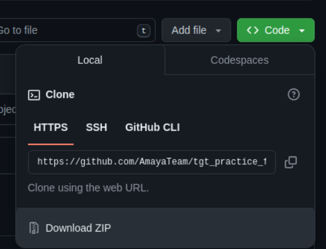
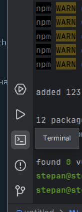
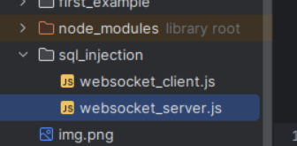
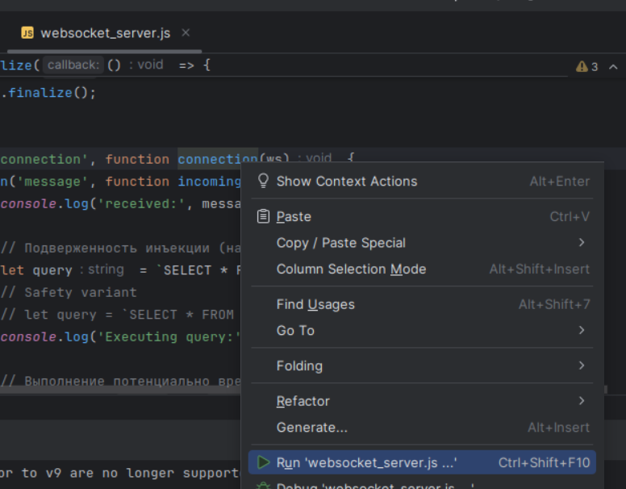

# Для запуска:

* Установить NodeJS с сайта https://nodejs.org/en
* Установить Jetbrains Webstorm https://www.jetbrains.com/webstorm/
* Скачать этот репозиторий в формате архива

* Распаковать в удобном месте и открыть через Webstorm эту папку
* Через командную строку установить зависимости:`npm install`

* На каждый пример есть файл сервера, и клиента, иммитирующий атаки

* Запустить надо оба файла, сначала сервер, потом клиент(открыть файл и нажать правую кнопку мышки)

